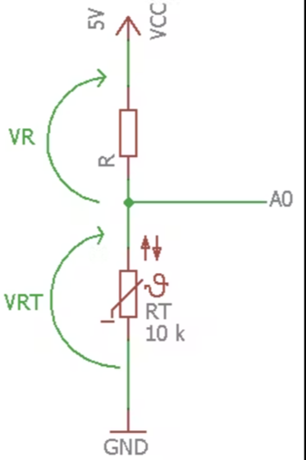
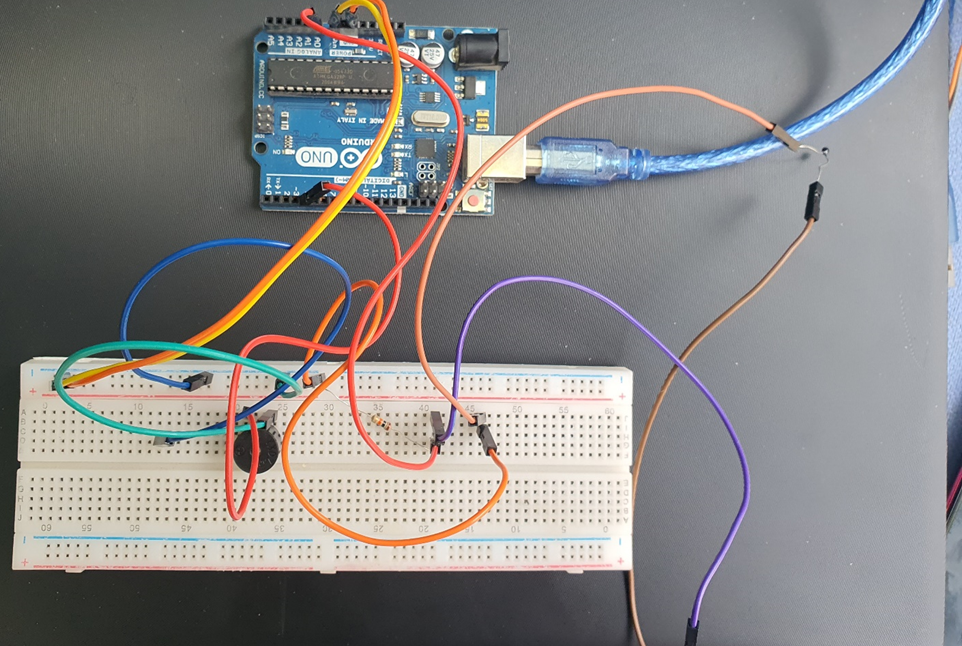

# Organture Application
## A- Description
Organ preservation is the baseline for a successful
organ transplant operation. So, in Emergency cases,
medical staff are forced to transport an organ from
hospital to another or to a center.
The most used technique in this case is the cold
organ box which preserves organs at certain
temperatures.
Medical staff need continuous monitoring of organ
temperature until it is transplanted, changing
temperature ranges depending on the case.
So, our application, will make it a little easier by monitoring temperature with thermistor
sensor and alarm the staff if the temperature is out of the range. These ranges are
determined by staff determine with mobile application .

## B- Circuit Components

- Arduino UNO
- Breadboard
- Jumpers
- Buzzer    
- HC-05 Bluetooth module
- Resistance 10KΩ
- NTC.5MM. DTC Thermistor sensor
- LEDs
- Needed for prototype: box with ice mixture.

## C-Thermistor Sensor

| Reason to use  | Thermistor  |           |
| -----------    | ----------- | --------- |
| Range         | -100°C to 450°C   |  Range is suitable for application as the temperature range for almost all organs is between -4 °C and 8°C          |
| Response     | Fast Response        | Suitable, as the staff can make fast decision for the organ or get alarmed rapidly.          |
| Cost     | Low / 21 L.E       | Not the best accuracy but it matches with its low cost as the organs cannot be affected by this tolerance. Only preservation time could be decreased    |
| Environment     | Suitable        | The box consists of three bags one of them is wet, which
would be suitable for the sensor and good indicator about
the organ temperature
|

## D- Circuit and its Calculations:
Known that: (All temperatures is measured in Kelvin)

RT = R0 e^(B(1/T - 1/T0))

As:
R0 => the resistance of the thermistor measured at
temperature T0
B => const coefficient got from datasheet
Then the measured temperature would be, depending on the
resistance of the thermistor

T = 1/((ln(RT/R0))/B) + 1/T0

## E - Simulation Link
[Circuit Simulation](https://drive.google.com/file/d/1DDd4Jwp2lAmsXJqhip_p--7kYybH9Qef/view?usp=sharing)

## F - Mobile Application

### Welcome Page

### Home Page

### Heart Page

## G - Schematic Diagram

## H- Hardware Snapshot

